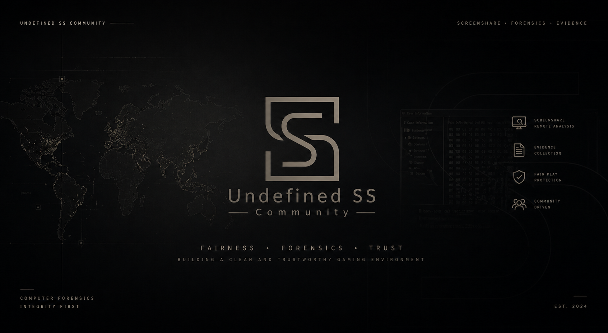

# Services Prechecker

Undefined SS Community 的 Windows 查端前置检查工具。它会在本机检查取证准备所需的系统服务，以及 ShimCache、Amcache 和当前用户 UserAssist 的记录条件，并可在一次管理员授权后恢复能够安全修复的启动方式、策略和现有系统任务。程序还会在本机生成用于设备识别的 HWID，并在后台检查是否存在新版本。

> **重要：启用任何所需服务后都必须重启 Windows。** 当前启动周期内的查端仍会按照“异常”处理；只有重启系统后的后续查端才有效。



应用采用专为小尺寸 Windows 图标重新设计的双 S“取证门”标记，并使用连续的低对比度取证地图界面。主界面现在统一展示 7 项系统服务和 3 类取证记录源；窗口较小时可以在卡片区域滚动查看，不会隐藏检测结果。

## 检查项目

| 界面名称 | Windows 服务名 | 启用后的启动方式 |
| --- | --- | --- |
| DNS Client | `Dnscache` | 自动 |
| Diagnostic Policy Service | `DPS` | 自动 |
| Connected User Experiences | `DiagTrack` | 自动 |
| Program Compatibility Assistant | `PcaSvc` | 手动并立即启动 |
| SysMain | `SysMain` | 自动 |
| Windows Event Log | `EventLog` | 自动 |
| Background Activity Moderator | `bam` | 系统启动；部分电脑需要重启 |

## 取证记录源

### ShimCache / AppCompatCache

程序检查 `DisableEngine` 应用程序兼容性策略，并在系统提供 `AeLookupSvc` 时确认它没有被禁用。不同 Windows 构建可能不再提供独立的 `AeLookupSvc`；这时不会擅自创建服务，而是依据系统内置兼容性引擎策略判断。修复兼容性引擎设置后必须重启，因为相关设置会被系统进程缓存，ShimCache 的磁盘数据也通常在正常关机或重启期间落盘。

### Amcache

程序综合检查：

- `DisableInventory` 兼容性清单策略；
- 已纳入原有检查的 `PcaSvc` 与 `DiagTrack`；
- 系统中实际存在的 `Microsoft Compatibility Appraiser` 和 `ProgramDataUpdater` 计划任务；
- `Amcache.hve` 是否已经生成（只作为提示，不会把“尚无历史”误判成可自动补回的数据）。

一键启用只会启用系统中已经存在但被禁用的任务，不会下载、伪造或自行创建缺失的 Windows 任务和 Hive。若精简系统、隐私脚本或系统损坏已经删除这些组件，界面会明确显示“系统组件不完整”。启用 Inventory Collector 可能允许 Windows 按微软的兼容性机制收集并向 Microsoft 发送应用、文件、设备和驱动程序清单；这是 Windows 原生策略的行为，不是 Services Prechecker 上传取证数据。

### UserAssist

UserAssist 不依赖独立系统服务。程序只针对**启动本程序的当前交互用户**检查并修复：

- `NoInstrumentation` 用户跟踪策略；
- “让 Windows 跟踪应用启动”对应的 `Start_TrackProgs` 设置；
- 当前会话是否存在 Explorer Shell。

管理员提权时会把原始用户 SID 传给辅助进程，即使标准用户输入了另一个管理员账户的凭据，也不会误改管理员的 UserAssist 设置。程序不会批量修改其他用户、加载离线 `NTUSER.DAT`、启动或替换自定义 Shell，也不会创建伪造的 UserAssist 历史。

这三项检查只能确保**后续记录机制具备条件**，不能补回启用前已经缺失或被清除的历史。空记录还可能来自系统刚安装、用户配置文件被重建、临时/漫游/非持久化配置文件、异常断电、Hive 与事务日志采集不完整、解析器不支持当前 Windows 结构、读取错误 ControlSet 或用户等情况。组织或域策略也可能在之后重新应用禁用值，因此重启后仍应再次运行本程序复检。

## 使用方法

1. 从 Undefined SS 官方下载地址获取带版本号的 `ServicesPrechecker-v*.exe`。版本化文件名可避免 Windows 资源管理器沿用旧版图标缓存。
2. 直接运行程序并查看 7 项系统服务与 3 类取证记录源的状态。读取状态不需要管理员权限。
3. 如果存在未运行、已禁用或策略关闭的项目，点击“一键启用全部数据源”。
4. 在 Windows 用户账户控制提示中确认授权。程序会自动处理可安全修复的服务、策略和现有任务并再次检测；缺失的系统组件会保留为明确提示。
5. 完成设置后必须重启电脑。不要在当前启动周期继续查端；本次结果仍会按照“异常”处理。
6. 如需提供设备标识，点击底栏中的“点击复制 · HWID …”；剪贴板中只会写入以 `USS1-` 开头的 HWID。
7. 检测到新版本时，可选择“稍后”或“前往下载”；后者只会在默认浏览器中打开官方文件直链，不会自动执行下载文件。

程序不会连接远程设备或采集文件。系统服务、注册表策略、计划任务、记录源状态与 HWID 均在当前电脑检查；程序不会读取或上传 ShimCache、Amcache、UserAssist 的实际取证内容。每次普通启动时，程序会异步检查版本并向 Undefined SS 统计接口发送一个仅限当前进程使用的随机事件编号及软件版本。它不会发送 HWID、用户名、设备名、系统服务状态或查端结果。与普通 HTTPS 请求一样，服务器会看到网络出口 IP；该地址只用于短时限流并以加盐散列形式处理。只有用户点击“前往下载”时，程序才会打开 `https://dl.screenshare.cn/services-prechecker`。

## 累计联网启动统计

每次普通启动最多向官方统计接口成功计入一次；用于启用服务的管理员辅助进程不会重复上报。上报在后台执行且设置短超时，断网、超时或服务器异常时会静默放弃，不阻塞窗口、服务检查或退出。正式域名暂不可用时会尝试 Cloudflare 备用地址，并复用同一个随机事件编号，由服务器在 48 小时内去重。

网站展示的是“服务器成功确认的累计联网启动次数”，不代表独立用户数或独立设备数，也不用于账号、授权、白名单或封禁。

## 版本检查

程序在每次普通启动时异步查询一次最新正式版本，不使用账号或访问令牌，也不会阻塞服务检测。同一次程序进程内最多检查一次；用于启用服务的管理员辅助进程不会检查版本。网络不可用、请求超时或返回内容无效时会静默跳过，不影响其余功能，并会在用户下次重新打开软件时再次尝试。

版本号按数字形式比较，不使用字符串排序。检测到新版本时才显示应用内弹窗；若同时需要提示重启，重启提示优先，关闭后再显示更新。下载地址固定为 Undefined SS 官方文件直链 `https://dl.screenshare.cn/services-prechecker`，不会采用 GitHub Release 的下载地址，也不会在后台自动下载或执行任何文件。

版本元数据优先来自 Undefined SS 部署在 Cloudflare 的官方下载节点；只有该节点不可用或返回内容无效时，程序才会回退查询 GitHub Releases。两个来源都只提供用于数字比较的正式版本号，远端返回的下载地址不会被采用。这样即使部分中国大陆网络无法访问 GitHub API，只要官方下载节点可用，更新提示仍能正常出现。

## HWID

底栏会以 `点击复制 · HWID  USS1-XXXX-XXXX-XXXX-XXXX-XXXX-XXXX-XX` 的格式显示设备标识。整段文字均可点击，不设置独立复制按钮；复制成功后会在原位置短暂显示“已复制”。也可使用键盘聚焦该文字并按 Enter 或空格复制。

`USS1` 表示第一版 HWID 算法。程序按 SMBIOS System UUID、主板序列号、BIOS 序列号的固定优先级选取第一个有效标识，过滤全零、全 F 及常见 OEM 占位值；硬件标识全部不可用时才回退到 Windows 注册表 `MachineGuid`。规范化后的字段与固定命名空间 `UndefinedSS.ServicesPrechecker/HWID/v1` 一起计算 SHA-256，截取 128 位摘要并使用 Crockford Base32 编码。原始硬件标识只在生成期间存在于内存中，不会显示、保存或上传。

在可读取有效硬件标识的正常物理电脑上，重装 Windows、更换系统盘或内存通常不会改变 HWID，更换主板则可能改变。若程序只能回退到 `MachineGuid`，重装 Windows 可能使 HWID 改变。OEM 重复标识、克隆虚拟机或人为修改 SMBIOS 也可能导致 HWID 重复或变化，因此它仅用于查端时辅助识别设备，不作为不可伪造的身份凭证，也不接入账号授权、白名单或封禁系统。

点击复制是用户主动将 HWID 写入 Windows 剪贴板的操作；若系统启用了剪贴板历史或跨设备同步，Windows 可能保留或同步该内容。Services Prechecker 自身不会上传 HWID。

## 为什么必须重启

Minecraft 查端通常判断的是本次电脑启动到查端人员远程连接期间的活动。如果用户在即将查端时才运行 Services Prechecker，刚启用的服务无法补回本次启动周期此前缺失的系统记录，因此本次查端仍按异常处理。

程序会记录“等待重启”状态。在同一次 Windows 启动中再次打开程序时，会继续明确提示当前周期无效；完成系统重启后，该提示会自动解除。

## 构建

项目使用 Windows 自带的 .NET Framework 4.x C# 编译器，可生成不依赖额外安装包的 64 位单文件 EXE。

```powershell
.\build.ps1
```

构建产物使用程序集版本生成唯一文件名，例如 `dist\ServicesPrechecker-v1.5.4.exe`。

## 代码签名

使用受信任的 Authenticode 代码签名证书：

```powershell
.\sign.ps1 -PfxPath "C:\secure\undefined-ss.pfx" -PfxPassword "<password>"
```

也可使用当前用户证书存储中的代码签名证书：

```powershell
.\sign.ps1 -CertificateThumbprint "<thumbprint>"
```

请勿把 PFX 文件或密码提交到仓库。GitHub Actions 可通过
`SIGNING_CERTIFICATE_BASE64` 和 `SIGNING_CERTIFICATE_PASSWORD` 两个仓库密钥对构建产物签名。
拉取请求只生成名称中明确标注 `unsigned-test-build` 的测试包，PR 工作流完全不引用签名密钥。签名位于独立的 `workflow_run` 工作流，只接受 `main` 的成功构建，并绑定 `code-signing` Environment。配置受保护 Environment、两个签名密钥和仓库变量 `ENABLE_SIGNED_CI=true` 后才会生成可分发的签名产物；建议为该 Environment 设置人工批准。

当前发布包附带社区自签名证书用于校验 Authenticode 签名与文件完整性；它不具备公共 CA 信任链或 SmartScreen 信誉。面向公众分发时，应在 GitHub Secrets 中配置受信任代码签名机构颁发的证书。

## 兼容性

- Windows 10 / Windows 11
- 64 位系统
- `.NET Framework 4.8`（现代 Windows 10/11 通常已内置或通过 Windows Update 提供）

## License

[GNU Affero General Public License v3.0](LICENSE)
